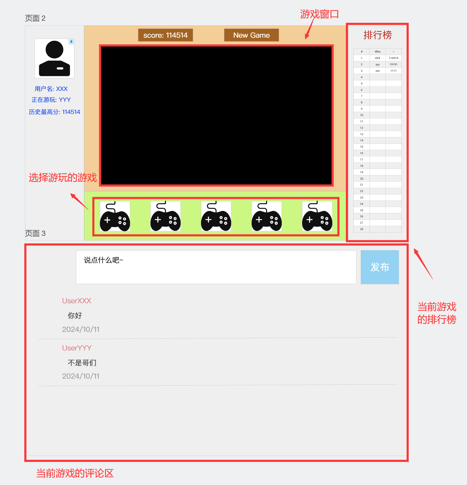
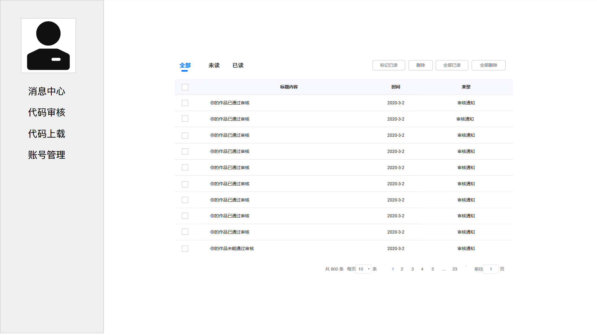
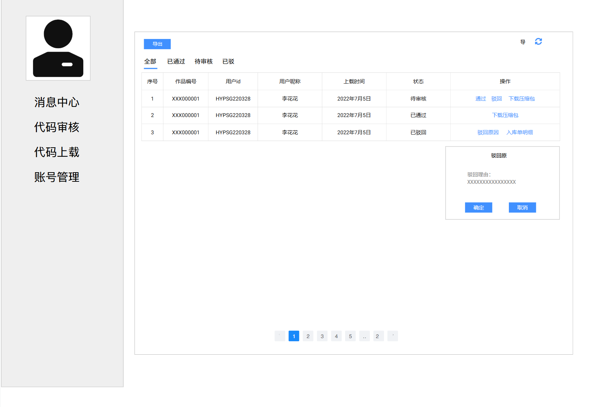
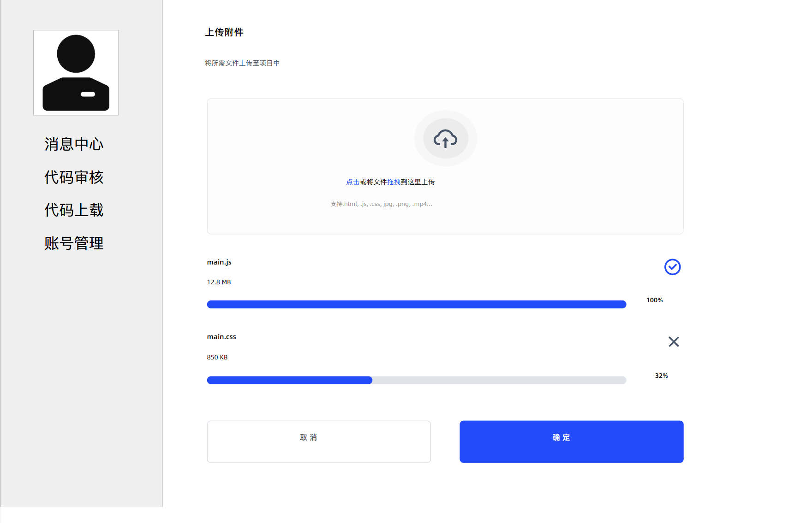
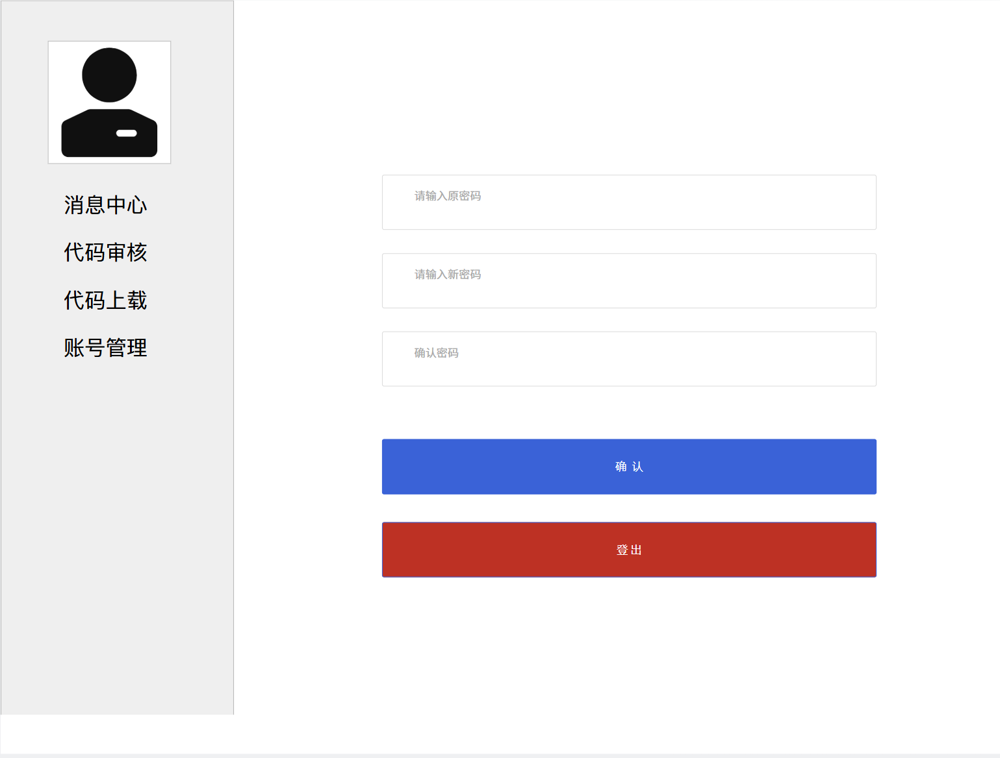

## 共享游戏开发平台原型系统
点击[这里](https://modao.cc/proto/Jc5jNApKskm5etGRZ8Cz7q/sharing?view_mode=read_only)可以访问共享游戏平台的原型系统。

## 快速原型截图
### 登录界面
登录界面应该是我们的共享开发平台的主页，其形式如下所示。

### 注册界面
在登录界面点击“没有账号？注册”字样后，自动跳转到注册界面。注册界面也可以跳转到登录界面。  
需要注意的是，用户可以随意注册，管理员则需要**口令验证正确**之后方可注册，以维护网页的正常运行与安全性。

### 游戏界面
登录成功后，跳转到游戏界面。初始游戏窗口将会打开一个默认的游戏。每个游戏都设有评论区，这些评论区为游戏开发者的版本更新、bug 修复提供了宝贵意见，同时也可以分享评论谈谈关于该游戏的攻略，只在实现**开放共享**的交流目的。任何用户均可发表评论；**管理员**负责审查这些评论，具有**删除评论**和**禁言玩家**的权限。

### 消息中心界面
在游戏界面中单击玩家头像，可以转到消息中心。消息中心主要包含管理员对用户提交的游戏作品的审核结果，以及评论区中涉及到自己的回复。界面左侧的列表中还有“代码审核”“代码上载”“账号管理”等项目。

### 代码审核界面
在消息中心左侧列表栏选择“代码审核”，可以跳转到代码审核界面，如下图所示。然而，只有管理员能够查看该界面；对于普通用户将显示**权限不足**。

### 代码上载界面
任何用户都可以上传自己的 canvas 小游戏作品。作品项目提交后，会发送到管理员的消息中心，由管理员进行处理。

### 账号管理界面
当用户想要修改密码，或者需要切换账号时，均可点击“账号管理”。选择“登出”后将回到[登录界面](#登录界面)。
