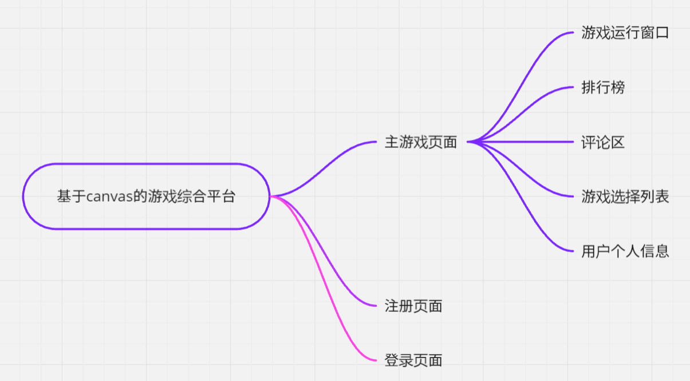
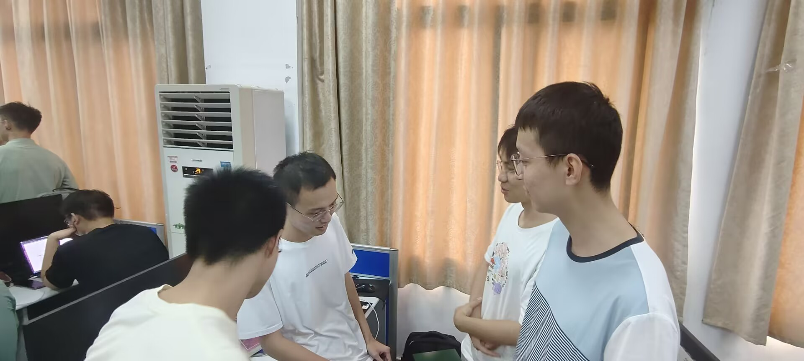

# 软件工程定项第一次会议记录

 * **参会者**：王锐，王鎮濠，李思睿，龚博远
 * **时间**：2024年9月21日周六 南一楼机房803

## 项目选择
基于canvas的游戏综合平台

### 1. 主要技术栈
**分成前端和后端网页开发**

**前端**：html，css，js，canvas。（商定中）

**后端**：PHP，Python，MySQL。（商定中）

### 2. 团队分工

**前端开发**：王鎮濠，李思睿，王锐，龚博远

**后端开发**：王锐，龚博远

**接口对接**：王鎮濠，李思睿

## 项目分析（头脑风暴）

### 1. 现有网页游戏平台的不足
>* 现有的游戏平台广告繁杂，影响体验和观感。
>* 某大型平台不仅需要下载，而且游戏良莠不齐，存在普遍的氪金机制，让游戏失去了本来的纯粹。
>* 现有游戏平台界面较为复杂，容易带来困扰。
>* 如经典的4399网页游戏平台，现在更新的游戏越来越无聊、低龄化，不如经典游戏好玩耐玩。
>* 多数游戏平台游戏要跳转到外部网页，不能开发自己的特色。
>* 且大多数游戏基于老旧的flash技术开发，现在已经落后力，甚至被绝大多数浏览器禁用，对此我们十分痛心。

### 2. 改进方式

- [x] 我们用爱发电，屏蔽一切不良广告！

- [x] 我们的游戏，均由自己手搓，使用H5开发，摆脱flash的牢笼，也便于维护！

- [x] 我们凭借自己的热爱和想象，复现多款经典游戏，同时给老游戏加入新元素，让经典游戏更具趣味性和可玩性！

- [x] 消除所有消费陷阱。

- [x] 精心设计界面，干净简洁又不失美观。

### 3. 题目来源

* 头脑风暴讨论结果

### 4. 需求

* 注册

* 登陆

* 用户数据管理

* 各种游戏基本功能的实现

* 不同游戏的得分规则

* 排行榜

* 实时PK（看情况实现）

* AI实现游戏推荐（看情况）

## 思维导图

## 会议图片

