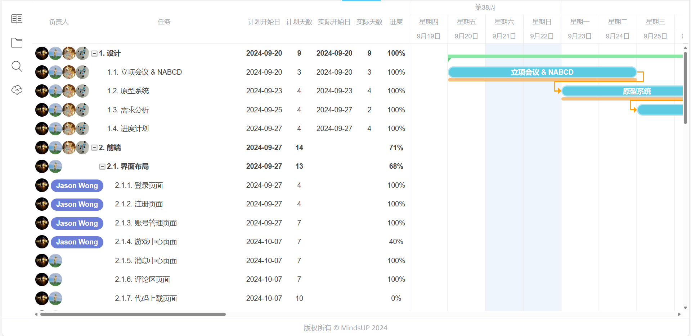

# 进度计划

## 设计

- 立项、NABCD
- 原型系统
- 需求分析
- 进度计划

## 开发

**任务分解：**

### 前端

（全体）

#### 界面布局

（王鎮濠，李思睿）

- 登录页面
- 注册页面
- 账号管理页面
- 游戏中心页面
- 消息中心页面
- 评论区页面
- 代码上载页面
- 管理员代码审核页面

#### 界面交互

（全体）

- 登录/注册/登出 操作提示
- 登录/注册/登出 & 个人中心页面跳转
- 游戏操作
- 游戏列表生成

#### 游戏设计

（全体）

### 后端

（全体）

#### 接口

（王鎮濠，李思睿）

- 登录接口
- 注册接口
- 用户修改密码接口
- 用户注销接口
- 排行榜分数查询接口
- 排行榜分数更新接口
- 评论发布接口
- 评论删除接口
- 消息中心查询接口
- 消息中心删除消息接口

#### 数据库

（王锐，王鎮濠，龚博远）

- 用户账号表
- 用户游戏分数表
- 游戏表
- 用户游戏作品表
- 用户评论表		

## 测试
（全体）

#### 单元测试

- 前端单元测试
- 后端API单元测试

#### 集成测试

- 本地服务器部署

- 前端组件集成测试

# 甘特图

[https://gantt.mindsup.cn/share/F5xBjkR1y](https://gantt.mindsup.cn/share/F5xBjkR1y)

